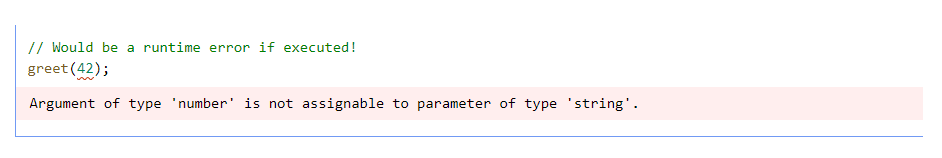
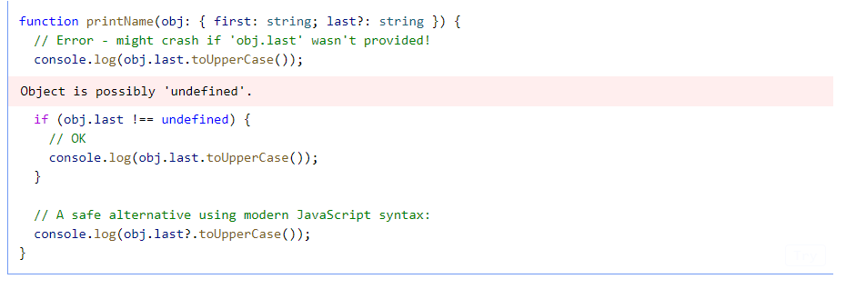
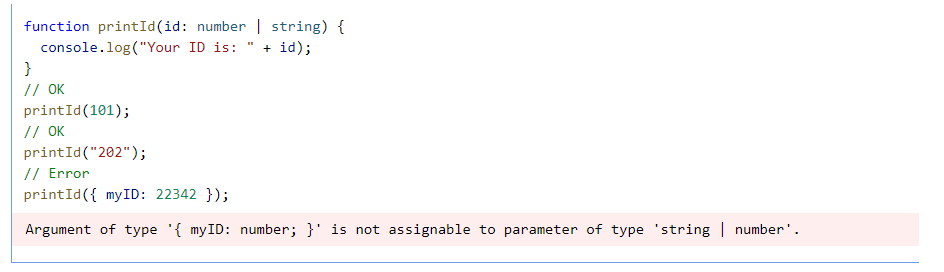
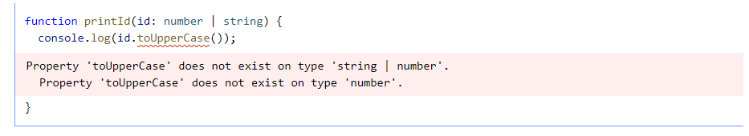

# Gündelik Tipler

Bu bölümde, JavaScript kodunda bulacağınız en yaygın değişken türlerinden bazılarını ele alacağız ve bu türleri TypeScript'te tanımlamanın yollarını açıklayacağız. Bu ayrıntılı bir liste değildir ve gelecek bölümlerde diğer türleri adlandırmak ve kullanmak için daha fazla yol açıklanacaktır.


Hadi JavaScript veya TypeScript kodu yazarken karşılaşabileceğiniz en temel ve yaygın tipleri gözden geçirerek başlayalım. Bu öğreneceklerimiz ileriki bölümlerde anlatacağımız daha karmaşık tiplerin temel yapı taşlarını oluşturacaktır.

### Temel değişken türleri : string , number ve boolean

JavaScript'in çok sık kullanılan 3 [değişken türü](https://developer.mozilla.org/en-US/docs/Glossary/Primitive) vardır: **string , number ve boolean.** Bu değişken türlerinin her birinin TypeScript'te dengi bir tip tanımlaması vardır. Tahmin edebileceğiniz üzere bu tip tanımlamarı da bu değişkenleri JavaScript'teki **typeof** operatörüyle kullandığımızda dönen değerlerle aynıdır:

* **string** veri tipi "hello word" gibi **string** değerler içindir
* **boolean** veri tipi **true** ve **false** değerleri içindir
* **number** veri tipi 42 gibi sayısal değerler içindir. JavaScript'te **int** ve **float** değerler için özel bir ayrım yoktur. Onun için her ikisi de **number'**dır**.**&#x20;

> Bu veri tiplerini String, Number , Boolean şeklinde kullanabilirsiniz fakat bazı özel durumlarda sorunlara sebebiyet verebilir. Bu sebeple tip tanımlamalarınızı her zaman küçük harflerle yapmaya çalışın.

### Diziler

**\[1,2,3]** gibi diziler için de **number\[]** söz dizimini kullanabilirsiniz. Bu söz dizimi herhangi bir tip ile çalışabilir. ( Örneğin **\["a","b","c"]** için **string\[]** ). Ayrıca **Array\<number>** söz dizimini de kullanabilirsiniz. Jenerikler kısmına geldiğimizde **`T<U>`**şeklindeki bu söz dizilimini daha ayrıntılı bir şekilde işleyeceğiz.

> \[string] bir dizi için değil bir [demet ](obje-tipleri.md#demet-veri-tipi)için yapılan bir tanımlamadır.&#x20;

### any

TypeScript, belirli bir değerin herhangi bir tip kontrolü hatasına neden olmasını istemediğinizde kullanabileceğimiz özel bir tip'e sahiptir. Bu tip **any** veri tipidir.

**any** veri tipini kullandığınız verinin her hangi bir özelliğine erişebilir ( o da **any** tipinde olacaktır), onu bir fonksiyon gibi çağırabilir, herhangi bir türdeki bir değere atayabilir veya söz dizimsel olarak hemen hemen her şeyi yapabilirsiniz.

```ts
let obj: any = { x: 0 };
// Aşağıdaki kodlar normalde yanlış kullanım olmasına rağmen hiçbiri derleyici
// hatası vermez.
// any kullandığınızda tip kontrolünü devre dışı bırakıyorsunuz gibi düşünebiliriz
// TypeScript programcının en iyisini bildiğini varsayar
obj.foo();
obj();
obj.bar = 100;
obj = "hello";
const n: number = obj;
```

> **`any`tipi**, yalnızca TypeScript'i belirli bir kod satırının uygun olduğuna ikna etmek için uzun bir kod yazmak istemediğinizde kullanışlıdır.

### noImplicitAny

Eğer bir değişkene spesifik bir tip tanımlamazsanız ve TypeScript değişkenin tipini tahmin edemediğinde değerini otomatik olarak **any** olarak tanımlar.

Genellikle böyle durumlardan sakınmak isteriz çünkü doğrudan tanımlanmamış **any** tipleri kodumuzda hatalara sebep olabilir. Bu durumlar için **noImplicitAny** seçeneğini kullanın. Bu seçenek kodunuzda doğrudan tanımlanmamış **any** tip bir veri olduğunda hata verecektir.

### Değişkenlerde Tip Atamaları

**const , let** veya **var** kullanarak bir değişken tanımladığınız zaman , isteğe bağlı olarak, değişkeninize bir tip atayabilirsiniz.

```ts
let myName: string = "Alice";
//          ^^^^^^ tip ataması
```

> TypeScript , tiplerin solda yazıldığı `int x = 0; gibi` tip tanımlama sistemlerini kullanmaz. Tip tanımlamaları her zaman değerden sonra yapılır.

Lakin çoğu zaman değişkeninize tip atamaya gerek yoktur. TypeScript değişkenin değerinden türü tahmin edebilir.

```ts
// tip atamasına gerek yok -- TypeScript 'myName' değişkeninin 
//'string' veri tipinde olduğunu anlar.
let myName = "Alice";
```

### Fonksiyonlar

Fonksiyonlar JavaScript'te veri işlemenin en temel yoludur. TypeScript fonksiyonunuzun hem girdisine hem çıktısına tip ataması yapabilmenizi sağlar.

#### Tip Fonksiyonu Parametreleri

Fonksiyonunuzu tanımlarken fonksiyonunun alacağı her parametre için tip ataması yapabilirsiniz. Tip atamaları parametre isminden sonra yapılır.

```ts
// Parametreye tip ataması
function greet(name: string) {
  //                 ^^^^^^^^
  console.log("Hello, " + name.toUpperCase() + "!!");
}
```

Fonksiyona bir parametre girildiğinde artık bu parametrenin tipi kontrol edilecektir.

<figure><figcaption></figcaption></figure>

> Parametrelerinize tip atamaları yapmasanız dahi TypeScript doğru sayıda argüman gönderilip gönderilmediğini kontrol eder.

### Fonksiyonun Döndürdüğü Değere Tip Ataması Yapmak

Ayrıca TypeScript'te fonksiyonun döndürdüğü değere de tip ataması yapabilirsiniz.

```ts
function getFavoriteNumber(): number {
  //                        ^^^^^^^^
  return 26;
}
```

Tabi bunu yapmanıza gerek yoktur çünkü TypeScript **return** ifadesinden bu fonksiyonun döndürdüğü değer tipini otomatik olarak tanımlayacaktır. Kullanıcılar belgeleme , karışıklıkları önleme veya diğer amaçlarla bu tanımlamayı yapmayı tercih edebilirler.

### Anonim Fonksiyonlar

Anonim fonksiyonlar düzenli fonksiyonlardan biraz daha farklıdır. TypeScript'in nasıl çalışacağını anlayabildiği bir fonksiyon oluşturulduğunuzda , bu fonksiyonun parametreleri için tipler otomatik olarak tanımlanır.

İşte aşağıda bir örnek :&#x20;

<figure><figcaption></figcaption></figure>

Yukarıda **s** değişkenine herhangi bir tip ataması yapmadık fakat Typescript, **forEach** fonksiyonu ve array'ın tipinden yola çıkarak **s** parametresinin alabileceği tipleri tahmin etmiştir.

Bu işlem **bağlamsal tipleme (**_**contextual typing**_**)** olarak adlandırılır çünkü fonksiyonun içinde bulunduğu bağlam değişkenlerin hangi tipe sahip olması gerektiğini bildirir.

Çıkarım kurallarına benzer şekilde, bunun nasıl gerçekleştiğini açıkça öğrenmeniz gerekmez, ancak bunun nasıl gerçekleştiğini anlamak, tür ek açıklamalarının ne zaman gerekli olmadığını fark etmenize yardımcı olabilir. Daha sonra, bir değerin içinde bulunduğu bağlamın onun türünü nasıl etkileyebileceğine dair daha fazla örnek göreceğiz.

### Nesne Tipleri <a href="#object-types" id="object-types"></a>

Karşılaşacağınız en yaygın türlerden biri de nesne türüdür. Bu, özellikleri olan herhangi bir JavaScript değerini ifade eder. Bir nesne tipi tanımlamak için, basitçe nesnenin özelliklerini ve tiplerini listeleriz.

Örneğin, burada nesne alan bir fonksiyon var:

```javascript
function printCoord(pt: { x: number; y: number }) {
  console.log("The coordinate's x value is " + pt.x);
  console.log("The coordinate's y value is " + pt.y);
}
printCoord({ x: 3, y: 7 });
```

Biz burada fonksiyonumuzun parametremisini **sayı tipinde x ve y olmak üzere iki özelliği bulunan bir nesne tipi** olarak tanımladık. Özellikleri sıralarken **;** veya **,** kullanabilirsiniz.

Ayrıca her özelliğin tip tanımlaması tamamen size bağlıdır. Eğer özel bir tip ataması yapmak istemezseniz **any** tipi olarak varsayılacaktır.

### Nesnelerde Opsiyonel Özellikler

TypeScript'te nesnelere opsiyonel özellikler tanımlayabiliriz. Bunu yapmak için, özellik adından sonra bir ? ekleyin:

```javascript
function printName(obj: { first: string; last?: string }) {
  // ...
}
// Both OK
printName({ first: "Bob" });
printName({ first: "Alice", last: "Alisson" });
```

JavaScript'te, var olmayan bir özelliğe erişirseniz, hata almak yerine **undefined** değerini alırsınız. Bu nedenle, opsiyonel bir özelliği kullanmadan önce **undefined** olup olmadığını kontrol etmeniz gerekir. Aşağıda bir fonksiyonun parametresi olan **obj** nesnesinin opsiyonel bir özelliği toUpperCase methoduyla çağırılmış. Hata vereceği durumlar ve doğru kullanımı gösterilmiştir.

<figure><figcaption></figcaption></figure>

### Union Types (Çoklu Tipler) <a href="#union-types" id="union-types"></a>

TypeScript'in tip sistemi, çok çeşitli operatörler kullanarak mevcut tiplerden yeni tipler oluşturmanıza olanak tanır. Artık bazı tiplerin nasıl yazılacağını bildiğimize göre, bunları ilginç şekillerde birleştirmeye başlamanın zamanı geldi.

### _Union Type Tanımlama_&#x20;

Tipleri kombine kullanmanın ilk yolu **Union** Tiplerdir. **Union ,** iki veya daha fazla türden oluşan ve bu türlerden herhangi biri ile kullanılabilen değerleri temsil eden bir türdür.&#x20;

Hadi dizeler veya sayılar üzerinde işlem yapabilen bir fonksiyon yazalım:

<figure><figcaption></figcaption></figure>

### Union Tiplerle Çalışmak

Bir **union** türüyle eşleşen bir değer sağlamak kolaydır - **union** üyelerinden herhangi biriyle eşleşen bir tür sağlamanız yeterlidir. Peki bir **union** tipinde bir değeriniz varsa, bununla nasıl çalışırsınız?

TypeScript, bir methodun kullanımına o methodun , **union'un** her üyesi için çağırılabilir olması durumunda izin verir. Örneğin, **string | number** union tipine sahipseniz, yalnızca **string tipi** üzerinde kullanılabilen methodları kullanamazsınız:

<figure><figcaption></figcaption></figure>

Çözüm ise çok basittir. Saf JavaScript'te olduğu gibi verinin tipini kontrol etmeli ve veri tipine göre işlem yapmalıyız:&#x20;

```javascript
function printId(id: number | string) {
  if (typeof id === "string") {
    // In this branch, id is of type 'string'
    console.log(id.toUpperCase());
  } else {
    // Here, id is of type 'number'
    console.log(id);
  }
}
```

Yukarıda **typeof** operatörü ile değişken tipini kontrol ettik ve bu tipe göre uygun işlemleri yaptık.

Bu örnek ise **Array.isArray** methoduyla alakalı :

```javascript
function welcomePeople(x: string[] | string) {
  if (Array.isArray(x)) {
    // Here: 'x' is 'string[]'
    console.log("Hello, " + x.join(" and "));
  } else {
    // Here: 'x' is 'string'
    console.log("Welcome lone traveler " + x);
  }
}
```

Üyelerin ortak kullandığı methodlarda bu kontrolü yapmanıza gerek yoktur :&#x20;

```javascript
function getFirstThree(x: number[] | string) {
  return x.slice(0, 3);
}
```


