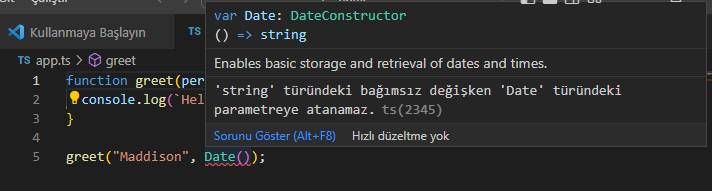

# Temeller

JavaScript'te her bir değer bir davranış kümesine sahiptir. Farklı operasyonlarla farklı davranışlar sergileyebilirler. Bu biraz teorik kaldı. Hadi bir örnek üzerinden devam edelim:

**message** isimli bir değişkenimiz olsun.

```js
// message üzerinden toLowerCase() metodunu çağırdık
message.toLowerCase();

// 'message' değişkeninin çağırdık
message();
```

Buradaki işlemleri biraz inceleyelim. İlk satırda _**message**_ üzerinden _**toLowerCase**_ metoduna eriştik ve onu çağırdık.

İkinci çalıştırılabilir kod satırındaysa direkt _**message**_ değişkenini çağırdık.

Peki varsayalım ki biz **message** değişkeninin değerini bilmiyoruz - ki üzerinde onlarca programcının çalıştığı projelerde bu çok yaygındır- .Program çalıştığında nasıl bir sonuç alacağız?  Bu kodlardan herhangi birini çalıştırmaya çalıştığımızda ne gibi sonuçlar elde edeceğimizi güvenilir bir şekilde söyleyemeyiz. Her bir işlemin davranışı tamamen ilk etapta sahip olduğumuz değere bağlıdır.

* **message** çağırılabilir bir değer mi ?
* **message** değişkeni **toLowerCase** metoduna sahip mi ?
* Öyleyse bile **toLowerCase** çağırılabilir bir metot mu ?
* Her ikisi de çağırılabilirse ne döndürecek ?

Bu soruların yanıtları genellikle JavaScript yazarken aklımızda tuttuğumuz şeylerdir ve tüm ayrıntıları doğru hatırladığımızı ummak zorundayız.

Diyelim ki **message** aşağıdaki şekilde tanımlandı.

```
const message = "Hello World!";
```

Sizin de tahmin edebileceğiniz gibi, **message.toLowerCase()** işlevini çalıştırmayı denersek, küçük harflerle yazılmış bir şekilde aynı değeri alırız.

Peki ya ikinci kod satırı? JavaScript'e biraz olsun aşina iseniz, bunun bir hataya sebep olacağını ve çalışmayacağını bilirsiniz.

```
TypeError: message is not a function
```

Bu gibi hatalardan kaçınabilseydik harika olurdu.

Kodu çalıştırdığımızda ; JavaScript, ne yapacağını bilmek için değişkenin tipine bakar. Değişkenin tipine göre farklı davranışlar sergiler.

Örneğin yukarıdaki örneğin ikinci çalıştırılabilir kod satırında değişken tipi **string'**dir fakat fonksiyon olarak çağırılmaya çalışılmıştır. Bu durumda uygulama **TypeError**  hatasını verdi.&#x20;

****

**String** ve **number** gibi bazı değerler için **typeof** operatörünü kullanarak veri tiplerini tanımlayabiliriz. Ancak fonksiyonlar gibi diğer şeyler için, tipleri tanımlama mekanizması yoktur.

Hadi aşağıdaki örnek kodu inceleyelim:

```js
function fn(x) {
  return x.flip();
}
```

Kodu okuyarak bu işlevin yalnızca **`flip` ** metodu çağırılabilecek bir nesne verildiğinde çalışacağını **gözlemleyebiliriz** , ancak JavaScript bu bilgiyi kod çalışırken kontrol etmemize izin vermez.

JavaScript'te yukarıdaki **fn** fonksiyonun nasıl davranacağını bilmenin tek yolu kodu çalıştırmak ve neler olacağını görmektir.

Bu da kodunuzun çalışmadan önce ne yapacağını bilmenin daha zor olmasına ve dolayısıyla kod yazmanın zorlaşmasına sebep olur.

Bu yönden bakıldağında tip dediğimiz şey  fn fonksiyonun hangi değerlerin geçmesine izin verdiği hangi değerlerin ise uygulamanın hata vermesine sebep olacağını belirleyen şeydir. JavaScript yalnızca gerçek dinamik tip kontrolünü destekler. Yani neler olacağını görmek için uygulamayı çalıştırmamız gerekir.

İşte bizi bu tür hatalardan kurtaran statik tip kontrolünü bir sonraki başlıkta inceleyeceğiz.

### Statik Tip Kontrolü

Daha önce bir **string'i** fonksiyon olarak çağırmaya çalışırken aldığımız **TypeError** hatasını hatırlayın. Çoğu programcı kodlarını çalıştırırken herhangi bir hata almaktan hoşlanmazlar. - Ki biz bu hatalara bug deriz - Ve yeni bir kod yazdığımızda, buglardan kaçınmak için elimizden gelenin en iyisini yapmaya çalışırız.

Programımıza biraz kod ekler, dosyamızı kaydeder, kodu yeniden çalıştırır ve hatayı hemen görürsek, sorunu hızlı bir şekilde izole edebiliriz; ancak bu durum her zaman böyle değildir.

Programı yeterince kapsamlı bir şekilde test etmemiş olabiliriz, bu nedenle bazı potansiyel hatalarla hiç karşılaşmamış olabiliriz. Ya da hataya tanık olacak kadar şanslı olsak bile sorunu çözmek , kodları yeniden yazmak veya yeni kodlar eklemek gibi zorlu bir uğraşın içine girecektik.

İdeal olarak, kodumuz çalışmadan önce bu hataları bulmamıza yardımcı olacak bir araca sahip olabiliriz. TypeScript gibi bir statik tip denetleyicilerinin yaptığı da işte budur. Statik tip sistemleri, programlarımızı çalıştırdığımızda değerlerimizin hangi davranışları göstereceğini tanımlar. TypeScript gibi denetleyicileri bu bilgiyi kullanır ve bize işlerin ne zaman raydan çıkabileceğini söyler.


<figure><figcaption></figcaption></figure>

TypeScript ile yukarıdaki kodu yazdığımızda , daha biz kodumuzu çalıştırmadan , tıpkı yukarıda olduğu gibi , hatayı bize gösterecektir.


### İstisna Olmayan Hatalar (Non-exception Failures)

Şimdiye kadar çalışma zamanı hataları gibi belirli şeyleri tartışıyorduk - Bazı durumlarda Javascript bize bir şeylerin yolunda gitmediğini söyler. Bu durumlar ortaya çıkıyor çünkü [ECMAScript standartlarında](https://tc39.es/ecma262/) , dilin beklenmedik bir durumla karşılaştığında nasıl davranması gerektiğine dair açık talimatlar vardır.

Örneğin çağıralamayan bir şeyi çaırmaya çalıştığınızda bir hata fırlatılır. Bu kulağa **beklenen bir davranış** gibi gelmektedir. Bununla beraber bir nesnenin olmayan bir özelliğine erişmeye çalıştığınızda JavaScript'in aynı şekilde hata fırlatmasını beklersiniz lakin JavaScript farklı davranır. Bize **undefined** değerini döndürür.

```js
const user = {
  name: "Daniel",
  age: 26,
};

user.location; // returns undefined
```

Nihayetinde , tip sistemi bir hatanın olduğunu belirtse bile JavaScript hemen hata vermeyecektir. Aynı kodu TypeScript ile yazdığımızda , bize konumun bulunamadığına dair bir hata verir.

<figure><figcaption></figcaption></figure>

TypeScript Bir çok hatayı yakalayabilir.

Örneğin büyük küçük harf hataları:

```ts

const announcement = "Hello World!";

// Yazım hatalarını ne kadar çabuk fark edebilirsiniz?
announcement.toLocaleLowercase();
announcement.toLocalLowerCase();

// muhtemelen yazmak isrediğiniz buydu...
announcement.toLocaleLowerCase();
```

fonksiyon hataları

<figure><figcaption><p>Veya</p></figcaption></figure>

Veya basit matematiksel hatalar

<figure><figcaption></figcaption></figure>

### TypeScript ve Araçlar

TypeScript, kodumuzda hata yaptığımızda hataları yakalayabilir. Bu harika, ancak TypeScript _aynı zamanda_ bu hataları yapmamızı da önleyebilir.

Type-checker (tip kontrolcüsü), değişkenler ve diğer özellikler üzerinde doğru özelliklere erişip erişmediğimiz gibi şeyleri kontrol edebilir. Ayrıca hangi özellikleri kullanmak isteyebileceğinizi de _önermeye_ başlayabilir.

Bu, TypeScript'in kod düzenleme için de kullanılabileceği ve tip denetleyicisinin siz editörde yazarken hata mesajları gösterebileceği ve kod tamamlama özelliği sağlayabileceği anlamına gelir.&#x20;

<figure><figcaption></figcaption></figure>

TypeScript'i destekleyen bir editör, hataları otomatik olarak düzeltmek için "hızlı düzeltmeler", kodu kolayca yeniden düzenlemek için yeniden düzenlemeler ve bir değişkenin değerini atamak veya belirli bir değişkene yapılan tüm referansları bulmak için kullanışlı gezinme özellikleri sunabilir.Tüm bunlar tip denetleyicisinin üzerine inşa edilmiştir ve tamamen çapraz platformdur, [bu nedenle favori editörünüzüm TypeScript desteğine sahip olması muhtemeldir.](https://github.com/Microsoft/TypeScript/wiki/TypeScript-Editor-Support)

### `tsc`, TypeScript Derleyicisi

Tip kontrolünden daha önce bahsettik . Peki bu kontrolleri kim yapıyor? Bu başlıkta TypeScript derleyicimiz **tsc** ile tanışacağız. Başlamadan önce onu **npm** aracılığıyla indirmeliyiz.

```
npm install -g typescript
```

> \-g komutuyla derleyiciyi global olarak kurmuş oluruz. Dilerseniz bunun yerine**`tsc'`**i ,**`npx` ** veya benzer araçlar ile yerel bir **`node_modules` ** paketinden çalıştırmayı tercih edebilirsiniz.

Şimdi boş bir klasöre geçelim ve ilk TypeScript programımızı yazalım: **`hello.ts`**:

```ts
console.log("Hello world!");
```

Dikkat ediniz ki burada özel bir şey yok. JavaScript'te nasıl **hello word** yazdırıyorsak burada da öyle.

Şimdi de indirdiğimiz **`typescript` ** paketi tarafından bizim için yüklenmiş olan **`tsc` ** komutunu çalıştırarak tip kontrolü yapalım.

```
tsc hello.ts
```

Tada!

Durun bir dakika . Ne oldu şimdi ? **tsc** komutunu çalıştırdık ve hiçbir şey olmadı.

Herhangi bir tür hatası yoktu, bu nedenle raporlanacak bir şey olmadığı için konsolumuzda herhangi bir çıktı almadık.

Fakat fark ettiğiniz üzere bunun yerine çıktı olarak bazı _**dosyalar**_ aldık. Ana dizinimize baktığımızda **hello.ts** yanında **hello.js** dosyasını görürüz. Bu bizim TypeScript derleyicimiz tarafından derlenmiş ve JavaScript'e dönüştürülmüş çıktı dosyamızdır. Bu dosyanın içeriğini kontrol ettiğinizde aynı kodları bulacaksınız.

```js
console.log("Hello world!");
```

Bu basit bir örnekti, TypeScript'in dönüştürmesi gereken çok az şey vardı ve bu sebeple bizim yazdığımızla neredeyse aynı görünüyor.

Peki kodumuzda tip kontrolü hatası olsaydı ne olurdu? Hadi **hello.ts** dosyasını yeniden yazalım!

```ts
// @noErrors
// bu insanları selamlayan basit bir fonksiyon:
function greet(person, date) {
  console.log(`Hello ${person}, today is ${date}!`);
}

greet("Brendan");
```

Eğer dosyamızı **tsc hello.ts** komutuyla tekrar çalıştırırsak komut satırımızda aşağıdaki uyarıyı göreceksiniz.

```
Expected 2 arguments, but got 1.
```

TypeScript bize **`greet` ** fonksiyonuna bir argüman eksik verdiğimizi söylüyor . Şimdiye kadar yalnızca standart JavaScript yazdık ve yine de tip denetimi kodumuzdaki sorunları bulabildi. Teşekkürler TypeScript!

### Hata Yayımlamak

Son örnekte kaçırmış olabileceğiniz bir şey var : **`hello.js` ** dosyamız , hata almamıza rağmen güncellendi. Bunun sebebi TypeScrip'in her zaman programcının kendisinden üstün olduğunu varsaymasıdır. Son örnekte de programcının bilip kendisinin bilmediği bir şey olduğunu düşünerek , hata vermesine rağmen , TypeScript kodunu JavaScript koduna çevirdi.

Daha önce de belirttiğimiz gibi; tip denetimi , programınıza gönderilecek değişkenleri sınırlayarak aslında kodunuzun çalışma şeklini sınırlar. Bu durum programınıza yanlış tipte veri gönderilmesini engellemek ve buglardan kaçınmak için harika bir yoldur. Ama bazı durumlarda bu durum pek yararımıza olmayabilir.&#x20;

Diyelim ki kısıtlı bir zamanınız var ve kodunuzu JavaScript'e derlerken tip hataları alıyorsunuz. Fakat derlenen JavaScript programı doğru çalışıyor. Bu durumda TypeScript dosyasını güncellemekle zaman kaybetmeye gerek var mı ?

Elbette, zaman içinde hatalara karşı biraz daha savunmacı olmak ve TypeScript'in biraz daha katı davranmasını isteyebilirsiniz. Bu durumda, **`noEmitOnError` ** derleyici seçeneğini kullanabilirsiniz.

```
tsc --noEmitOnError hello.ts
```

Bu **seçenek  (flag)** ile artık koddaki herhangi bir tip hatasında kodu JavaScript dosyasına dönüştürmez. Programı yukarıdaki gibi çalıştırdığınızda **hello.js** dosyasının güncellenmediğini göreceksiniz.

### Tip Belirtme

Son örneğimizde insanları selamlayan basit bir fonksiyon yazmıştık. Fakat bu fonksiyonun alacağı argümanlar için herhangi bir tip belitmemiştik. Hadi kodumuza biraz ekleme yapalım ve **date** argümanına **Date** ve **person** parametresi için **string** tipini belirleyelim. Daha sonra **date** argümanına **toDateString()** methodu ile kullanalım.

```ts
function greet(person: string, date: Date) {
  console.log(`Hello ${person}, today is ${date.toDateString()}!`);
}
```

Yaptığımız değişiklikle , kodumuzun son halini okuyan birisi **greet** fonksiyonunun **string** veri tipinde **person** argümanı ve **Date** veri tipinde **date** argümanı alacağını açıkça görecektir.

Yaptığımız bu tip atamalarıyla beraber TypeScript, **greet** fonksiyonun yanlış çağrılmış olabileceği durumlarda bize gerekli uyarıları yapacaktır. Örneğin...

```ts

function greet(person: string, date: Date) {
  console.log(`Hello ${person}, today is ${date.toDateString()}!`);
}

greet("Maddison", Date());
```

Ne? TypeScript ikinci argümanımızda biza aşağıdaki hatayı bildirdi, ama neden?

<figure><figcaption></figcaption></figure>

Buradaki uyarının sebebi JavaScript'te **Date()** fonksiyonun **string** döndürmesidir. Oysa ki **new Date()** bize istediğimiz gibi **Date** tipinde bir veri döndürecektir.

Her neyse , hızlıca bug'ı çözelim.

```ts
function greet(person: string, date: Date) {
  console.log(`Hello ${person}, today is ${date.toDateString()}!`);
}

greet("Maddison", new Date());
```

Ayrıca biz tip ataması yapmak için her zaman veri tipi yazmak zorunda değiliz. Çoğu durumda, TypeScript, biz onları atlasak bile,  tanımlanan veri değerinden otomatik olarak tip ataması yapabilir.

```ts
let msg = "hello there!";
//  ^?
```

Yukarıdaki örnekte TypeScript biz veri tipini vermesek bile , değişkenin atanan değerinden bu veri tipini çıkartır.

Bu TypeScript'in bir özelliğidir. Ve eğer değişken değerini hemen atayacaksanız tip açıklaması eklememek daha iyidir.

> Editörünüzde değişkeninin üzerine giderseniz size değişkeninizin tipinin string olduğunu söylecektir.

<figure><figcaption></figcaption></figure>

### Tip Belirteçlerinin Silinmesi

Hadi **tsc** derleyicisinin çıktı olarak **greet** fonksiyonuna ne yaptığına bir bakalım.

```ts
function greet(person, date) {
    console.log("Hello ".concat(person, ", today is ").concat(date.toDateString(), "!"));
}
greet("Maddison", new Date());

```

Burada dikkat etmeniz gereken iki  nokta var :

* **person ve date** argümanlarının tip ataması yok.
* "**template string**" - ters tikler kullanan string (\`\` \`\`\` karakteri) - düz string'e dönüştürüldü.

İkincisini daha sonra anlatacağımız için şimdilik ilk noktaya odaklanalım.Tip atamaları JavaScript'in (veyaECMAScript'in) bir parçası değildir, bu nedenle saf TypeScript'i çalıştırabilen herhangi bir tarayıcı yoktur.Bu nedenle kodunuzu tarayıcıların çalıştırabilmesi için TypeScript'in her şeyden önce bir derleyiciye ihtiyacı vardır. Derleyici , TypeScript'e özgü kodların çoğunu silerek JavaScript'e dönüştürür.

> Tip açıklamaları kodunuzun çalışma zamanındaki davranışını etkilemez

### Kod Seviyesini Düşürme (Downleveling)

Yukarıdaki bir diğer fark, şablon string'in yeniden yazılmasıydı. Kodumuz bundan&#x20;

```js
`Hello ${person}, today is ${date.toDateString()}!`;
```

buna dönüştü

```js
"Hello " + person + ", today is " + date.toDateString() + "!";
```

Bu neden oldu?

Şablon dizeleri, [ECMAScript'in  ](https://tr.wikipedia.org/wiki/ECMAScript),ECMAScript 2015 adlı bir sürümüne ait bir özelliktir.

Varsayılan olarak TypeScript, ECMAScript'in son derece eski bir sürümü olan ES3'ü hedefler. **target** seçeneğini kullanarak biraz daha yeni bir şey seçebilirdik.

Kodumuzu **--target es2015** ile çalıştırmak TypeScript'i ECMAScript 2015'i hedefleyecek şekilde değiştirir, yani kod ECMAScript 2015'in desteklendiği her yerde çalışabilmelidir.

Yani **tsc --target es2015 hello.ts** çalıştırıldığında aşağıdaki çıktı elde edilir:

```
function greet(person, date) {
    console.log(`Hello ${person}, today is ${date.toDateString()}!`);
}
greet("Maddison", new Date());

```

> Varsayılan hedef ES3 olsa da, mevcut tarayıcıların büyük çoğunluğu ES2015'i desteklemektedir. Bu nedenle çoğu geliştirici, eski tarayıcılarla uyumluluk önemli olmadığı sürece, hedef olarak ES2015 belirleyebilir.

``

